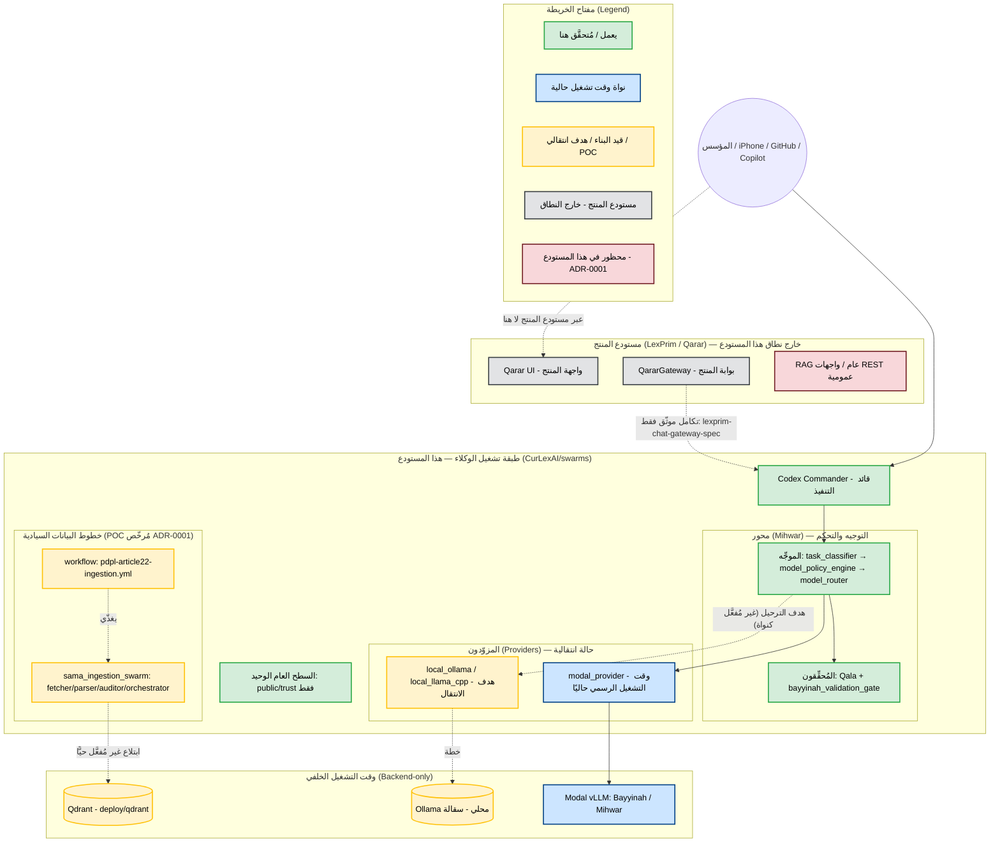

# 🗺️ خريطة المعمارية السيادية — النسخة المُصحَّحة (مطابِقة لواقع المستودع)

> **الغرض:** تصحيح «خريطة المعمارية 2.0» المتداولة بحيث تطابق **الحالة الفعلية**
> لمستودع `CurLexAI/swarms` كما هو في الكود، لا كما هو مأمول. كل بند موسوم
> بمصفوفة الأدلة (`VERIFIED` / `INFERRED` / `UNVERIFIED`).
>
> **المراجع الحاكمة (لا يُستبدَل بها هذا المستند):**
> `docs/decisions/ADR-0001-swarms-boundary.md` (الحدود)،
> `docs/program-overview-ar.md` (الطوبولوجيا الرسمية)،
> `docs/local-models-migration-ar.md` (خطة الانتقال إلى المحلي).

---

## 0. لماذا التصحيح؟ — فصل المستودعَين

أهم تصحيح: **خريطة 2.0 تصف منصة المنتج (LexPrim / Qarar monorepo)**، بينما هذا
المستودع `CurLexAI/swarms` هو **طبقة تشغيل الوكلاء والتحقق وخطوط البيانات
السيادية** فقط (`ADR-0001`). خلط المستودعَين هو مصدر أغلب التباينات أدناه.

| ادعاء «خريطة 2.0» | الواقع في هذا المستودع | الإثبات |
|---|---|---|
| «تم التخلص بالكامل من Modal» | **غير صحيح.** Modal ما زال هو وقت التشغيل الرسمي في الكود: `.agents/providers/modal_provider.py`، `.agents/modal_app.py`، `modal/qarar_rag_infra.py`، وبوابة `modal-boundary-gate`. الانتقال إلى المحلي **خطة لم تكتمل** (`local-models-migration-ar.md` بصيغة الأمر «يجب/يمكن»). | VERIFIED |
| النواة المحلية Ollama/Qdrant تعمل كنواة | **سقالة موجودة فقط**: `.agents/providers/local_ollama.py`، `src/policy/sovereign/providers/local_ollama.py`، `deploy/qdrant/docker-compose.yml` — دون إثبات تشغيل حيّ (لا smoke test). | INFERRED |
| «Harvester / `official_data_ingestor.py`» | **الملف غير موجود.** المُكافئ الفعلي هو سرب `sama_ingestion_swarm/` (fetcher/parser/auditor/orchestrator) + workflow `pdpl-article22-ingestion.yml`، وهو **POC مُرخّص بـ ADR-0001 فقط** لا نواة. | VERIFIED |
| «RAG Pro» كنواة استرجاع عامة | `ADR-0001` يُدرج **خطوط RAG العامة ضمن المحظور** في هذا المستودع. (يُسمح بخطوط البيانات السيادية الخاصة فقط ضمن الفئة الخامسة.) | VERIFIED |
| «Qarar UI + QararGateway» | لا توجد واجهة منتج هنا — السطح العام الوحيد هو `public/trust/` (صفحة ثقة + سلامة CDN). الواجهة والبوابة تعيشان في **مستودع المنتج**. | VERIFIED |
| طبقة التحكم (Mihwar/الموجِّه/البوابات) | **موجودة وتعمل**: `.agents/router/` (classifier→policy→router)، `.agents/validators/` (Qala + bayyinah gate). تفعيل Mihwar/Bayyinah الحيّ يبقى `UNVERIFIED` حتى تنجح smoke tests على الـ endpoints. | VERIFIED / UNVERIFIED للتفعيل |

---

## 1. المخطط المُصحَّح (يعكس الكود الحالي)

---

## 2. القراءة التشغيلية الدقيقة

- **النواة الحالية = Modal، لا المحلي.** الطوبولوجيا الرسمية في
  `program-overview-ar.md` ما زالت تمرّ عبر *Modal sovereign model runtime
  (Bayyinah / Mihwar via vLLM)*. الانتقال إلى Ollama/Qdrant **مخطّط** ولم
  يُفعَّل كنواة. أي ادّعاء بأن «Modal أُزيل» هو `UNVERIFIED` حتى تُنفَّذ بنود
  `local-models-migration-ar.md` ويُثبت ذلك بـ smoke test وأدلة في
  `docs/operations/model-runtime-evidence.md`.

- **«Harvester» ليس ملفًّا قائمًا.** لا يوجد `official_data_ingestor.py`.
  الابتلاع الفعلي يقع في سرب `sama_ingestion_swarm/` (POC مُرخّص) ولم يُفعَّل
  حيًّا؛ تفعيله يستلزم خروجًا شبكيًا (`network-boundary` + `qala-egress-residency`)
  وكتابة إلى Qdrant، ويحتاج **إذنًا صريحًا**.

- **لا واجهة منتج هنا.** السطح العام في هذا المستودع هو `public/trust/` فقط،
  وقد اجتاز `public-surface-boundary-gate` و`modal-boundary-gate` (لا تسريب
  `*.modal.run` ولا استدعاء مباشر لقاعدة بيانات). واجهة Qarar وبوابتها في
  مستودع المنتج، ويُوثّق تكاملهما عبر `docs/integrations/lexprim-chat-gateway-spec.md`.

- **RAG العام محظور هنا.** بناء أو تفعيل خط RAG عام داخل هذا المستودع يُسقِط
  بوابة `adr-0001-boundary-gate`. المسموح فقط: خطوط بيانات سيادية خاصة (Modal/Qdrant)
  ضمن الفئة الخامسة.

---

## 3. الخطوات التالية الآمنة (داخل النطاق)

1. **توسيع تدقيق الحدود** (آمن، بلا أسرار): تشغيل
   `public-surface-boundary-gate` + `modal-boundary-gate` + `adr-0001-boundary-gate`
   + `qala-egress-residency-gate` دوريًا في CI.
2. **مواءمة سرب SAMA دون تشغيل حيّ**: مراجعة `sama_ingestion_swarm/` و
   `pdpl-article22-ingestion.yml` للتوافق مع ADR-0001 عبر dry-run/اختبارات فقط.
3. **تفعيل الابتلاع الحيّ**: قرار خارج هذا المستودع (أو ضمن نطاق POC بإذن صريح)،
   ويحتاج خروجًا شبكيًا وكتابة Qdrant — غير مُفعَّل افتراضيًا.

> **ملاحظة منهجية:** هذا المستند وصفي/مرجعي ولا يغيّر أي سلوك تشغيلي. أي تفعيل
> فعلي (Modal→محلي، أو الابتلاع الحيّ) يتطلب تنفيذ بنوده الحاكمة وإثباتًا بـ
> smoke test، لا مجرّد تحديث الخريطة.
